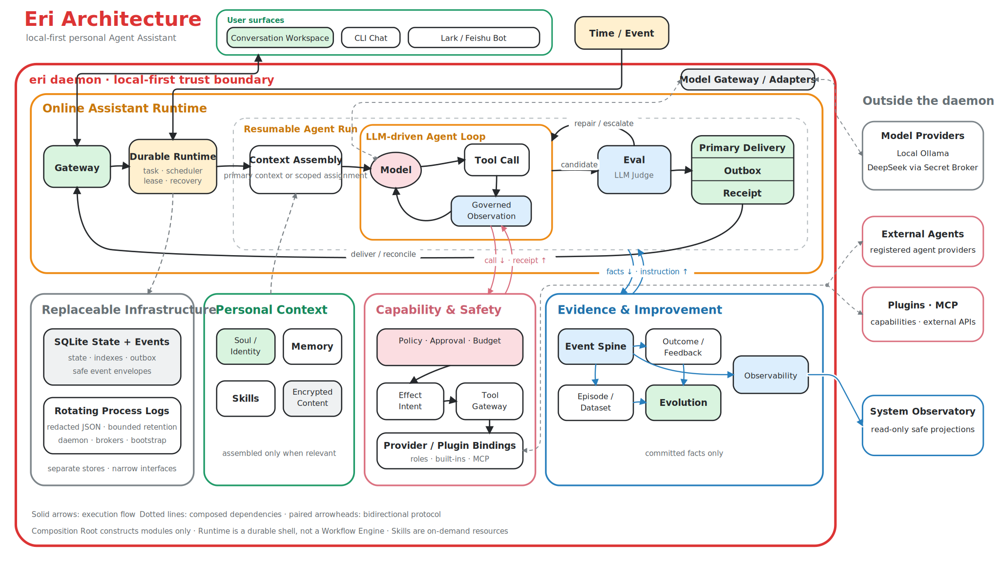

# Eri

Eri is a general-purpose personal Agent Assistant. It understands intent, maintains long-term context, uses tools to complete real tasks, and is designed to grow into planning, proactive reminders, problem discovery, memory, and multi-agent collaboration.

Eri serves its creator first and is developed as an open-source project so anyone can run an instance that belongs entirely to them.

Repository: [github.com/z-chenhao/eri](https://github.com/z-chenhao/eri)

> Status: MVP release candidate. The repository contains working vertical slices for the Agent Loop, context compaction, durable recovery, multimodal input, memory lifecycle, scheduling, subagents, dataset snapshots, guarded self-evolution, an owner-bound Lark/Feishu Channel, and a Google Workspace Plugin whose durable authorization is isolated in an External Auth Broker.

## Principles

- Assistant mindset: the user interacts with Eri, not a model, workflow, task board, or agent cluster.
- Agent Loop: the LLM reasons about open-ended work; deterministic Runtime protects recovery, authority, cost, and side effects.
- Strictly local-first: full identity, Soul, memory, and relationship history remain local by default.
- User sovereignty: Eri may act proactively, challenge, and advise against an action, but ultimately serves the user under the user's control.
- Outcome ownership: every external delivery passes Eval; execution is observable, recoverable, and reusable as governed evaluation evidence.

## Sources of truth

- [MVP product](docs/mvp-product.md): positioning, Soul, relationship, scenarios, and product form.
- [MVP technical design](docs/mvp-technical.md): invariants, architecture, Agent Loop, Memory, Eval, Plugins, observability, and security.
- [Agent guide](AGENTS.md): durable repository rules for coding agents.
- [Contributing](CONTRIBUTING.md): task contracts, development loop, and completion standards.

The product and technical documents are the unique sources of truth. Do not infer conflicting behavior from old conversations, discarded proposals, or competitor implementations.

## Build from source

The MVP target is macOS. Build with the Go toolchain pinned in `.go-version`. The default local model requires [Ollama](https://ollama.com/) and enough memory and disk for a 35B quantized model. Smaller local models can be selected during first-run setup, with corresponding capability trade-offs.

```bash
git clone https://github.com/z-chenhao/eri.git
cd eri
ollama pull qwen3.6:35b-a3b-q4_K_M
make build
./bin/eri doctor
./bin/eri daemon
```

On first interactive start, `eri daemon` discovers local Ollama models and offers Ollama or DeepSeek. DeepSeek API keys are entered without terminal echo. After validation, the same process starts the daemon and prints both URLs:

- Conversation Workspace: <http://127.0.0.1:7780>
- System Observatory: <http://127.0.0.1:7781>

`doctor` checks provider reachability, model availability, local semantic-Memory capability, the data root, and daemon socket. `eri logs --follow` tails the redacted structured runtime log, while `eri diagnose` creates a review-before-sharing diagnostic archive that excludes conversation bodies, prompts, Tool Results, the database, and credentials.

## Architecture



The editable SVG and its PNG export live in [`docs/assets/eri-architecture-handdrawn.svg`](docs/assets/eri-architecture-handdrawn.svg) and [`docs/assets/eri-architecture-handdrawn.png`](docs/assets/eri-architecture-handdrawn.png).

The large outline is only a single-process deployment boundary. The visual center is a recoverable Agent Run composed from Context, Agent Loop, Eval, and Delivery—not a giant daemon object. Personal Context, Capability, Safety, Evidence, and Infrastructure enter through explicit boundaries. The LLM owns understanding, reasoning, and native Tool Calling; deterministic Runtime owns recovery, scheduling, idempotency, cost, and side-effect boundaries. Skills are on-demand resources, not a Runtime or Workflow.

```text
eri/
├── AGENTS.md
├── CONTRIBUTING.md
├── LICENSE
├── Makefile
├── README.md
├── cmd/eri/                    # Main binary and CLI
├── brokers/googleauth/         # Isolated OAuth and Keychain trust zone
├── plugins/googleworkspace/    # Calendar and Gmail MCP Plugin
├── plugins/google-workspace.json
├── docs/
│   ├── mvp-product.md
│   └── mvp-technical.md
├── internal/                   # Domain-modular Go monolith
│   └── channel/lark/           # Owner-bound Lark/Feishu bot adapter
├── scripts/check-repo.sh
└── web/
    ├── conversation/           # Embedded Conversation Workspace
    └── observatory/            # Separate developer observability UI
```

The full package tree in the technical design expresses boundaries, not scaffolding. Packages appear only with a real vertical slice.

## Working MVP capabilities

- One `eri` binary provides daemon, CLI chat, status, stop, install, uninstall, doctor, logs, and diagnosis. Optional out-of-process helpers isolate the Google Workspace Plugin and durable Google authorization.
- Web, CLI, and an explicitly configured owner-bound Lark/Feishu bot share one authoritative SQLite conversation. Conversation and Observatory use separate URLs and sessions.
- The first authenticated Web or CLI connection emits one durable introduction request. Eri generates the introduction from the current Soul through the ordinary Agent Loop, Eval, Delivery, and Receipt path; clients contain no fixed assistant greeting.
- User content, model/runtime trace bodies, attachments, and artifacts live in an AES-256-GCM Content Store; SQLite, Events, and logs retain references and governed metadata, not plaintext bodies.
- Current state, Event Spine, and Internal Outbox commit atomically.
- The Agent Loop consumes provider-native assistant text and `tool_calls`; there is no private Decision JSON contract.
- Ollama and optional DeepSeek providers use the same native tool loop. Raw candidates are never shown before Eval.
- A deterministic safety gate precedes a general LLM Judge. The Judge sees the task, activated Skills, confirmed Tool Results, and Receipts. Repair returns to the same Agent Loop; only Pass enters the Delivery Outbox.
- Presence comes from the Task read model and never creates fake status messages.
- File, terminal, web, Memory, Task, Plugin, Commitment, notification, and user-data capabilities all pass through Effect Intent, Policy, Approval, and Receipt.
- File attachments are encrypted and downloadable from their source message. Text enters Context as untrusted data. Images are sent only to providers that declare vision support; other providers state that the image was not inspected.
- Approval is bound to the original Tool, target, parameter hash, and expiry. A waiting task resumes its encrypted continuation after approval, rejection, or daemon restart.
- Memory preserves conflicting Evidence and updates weighted Beliefs instead of overwriting old Claims. Recall combines protected lexical terms, associations, and optional local Ollama embeddings before governed reranking. Embedding vectors remain encrypted locally; when no local embedding model exists, Eri reports the lexical/associative downgrade instead of sending Memory to a cloud embedding service.
- Explicit feedback links to the original Task, Artifact, and Delivery. Correction or rejection invalidates obsolete Episodes and Dataset Candidates; silence is never interpreted as satisfaction.
- Conversation can export all user data. Full erasure requires strong approval, waits for other work to stop, removes user content and derived data, compacts SQLite, and retains only a content-free erasure receipt.
- Scheduler and `builtin.tasks` keep commitments after the page closes. Proactive automation follows propose, obtain consent, then create the Commitment.
- Skills follow the open Agent Skills convention: load `SKILL.md` after model selection, then load referenced resources on demand. There is no keyword router, private manifest, or Skill Runtime.
- Plugins use a versioned local Manifest and an MCP subprocess. Because the MVP has no OS sandbox, install and upgrade execute only explicitly trusted local code and require strong approval; failed health checks roll back.
- Google Workspace provides Calendar list/create and Gmail metadata list/get/send. A separate OAuth Broker stores durable refresh grants only in macOS Keychain and exposes isolated issuer and redemption sockets. Core, Plugins, EriDataRoot, logs, Memory, Episodes, datasets, and exports never receive passwords, cookies, API keys, refresh tokens, or durable grants.
- Primary Eri delegates through one governed Tool to stable workplace roles: an `intern` for routine time-consuming information work and an `engineering_team` for project, code, and data work. Runtime binds those roles to installed Providers (`eri_native` and, when available, local Codex; future installations may use Claude Code or Pi Agent). The native Intern is asynchronous and reuses Eri's Agent Loop with a restricted context, read-only Tool ceiling, and private Result sink. No subagent faces the user or bypasses primary Eri's evaluation and delivery.
- Guarded self-evolution splits at least six failure signals into training and unseen holdout. A protected candidate can enter a stable 20% canary only after independent evaluation; one non-Pass retires it, while eight Pass outcomes promote it. Candidates cannot modify protected Soul, safety, or authority boundaries.
- Internal Run Events use a CloudEvents 1.0-compatible envelope. AG-UI and A2A 1.0 are safe edge projections, not internal domain models or falsely advertised complete servers.
- Conversation combines a narrow iMessage-like thread with a wide, read-only execution canvas. The canvas is architecture-aligned, pans freely in two dimensions, grows Agent Loop turns downward, preserves selection during live updates, and reveals only governed causal facts. System Observatory owns raw committed events, full runtime details, Episodes, datasets, and evolution controls.

## Local development

```bash
make help
make check
make build
./bin/eri daemon
./bin/eri logs --follow
./bin/eri diagnose
```

The source baseline is Go 1.25; `.go-version` pins the current security patch. Non-interactive startup fails clearly if no provider profile exists. By default, all non-credential local state—including SQLite, encrypted Content, runtime sockets, exports, and persistent logs—lives under the current workspace's Git-ignored `.eri/` directory. API keys, OAuth grants, App Secrets, and Content master keys remain outside it in process memory or macOS Keychain. `ERI_DATA_ROOT` is available only when an explicit alternate root is required.

For a temporary developer override, keep secrets out of `.env` and Git:

```bash
read -s DEEPSEEK_API_KEY
export DEEPSEEK_API_KEY
export ERI_MODEL_PROVIDER=deepseek
./bin/eri doctor
./bin/eri daemon
```

Public Web search and readable-page extraction use Tavily when its runtime-only credential is present. Search and extract depth remain explicit provider-cost choices:

```bash
read -s TAVILY_API_KEY
export TAVILY_API_KEY
export TAVILY_SEARCH_DEPTH=basic
export TAVILY_EXTRACT_DEPTH=basic
```

Without `TAVILY_API_KEY`, Eri does not advertise `builtin.web`; it never falls back to scraping search-result HTML and reporting redirects as evidence.

DeepSeek uses the official cost-efficient `deepseek-v4-flash` model, native non-thinking Tool Calls, Thinking for Tool-free evaluation and structured synthesis, stable request prefixes for provider prompt caching, and recorded cache hit/miss token counts. Eri does not send `max_tokens` to DeepSeek and has no fixed model-turn or Task/day/month model-token ceiling; the Agent Loop runs until delivery, cancellation, approval wait, an unrecovered provider or context/account limit, deadline, or another durable terminal condition. `ERI_MAX_EVAL_ATTEMPTS` is an Eval repair fuse, not an Agent Loop length limit.

The file capability observes the daemon's startup directory by default. Override it explicitly when developing:

```bash
ERI_WORKSPACE_ROOT=/absolute/path/to/workspace ./bin/eri daemon
```

Built-in Skills live in `skills/`. User-configured Skills are discovered only from `~/.eri/skills/`; Eri does not import `~/.agents/skills`, project `.agents/skills`, workspace `.eri/skills`, or arbitrary external Skill directories.

Plugin installation happens through conversation. A local Manifest declares `schema_version`, `id`, semantic version, `mcp_stdio` runtime, and minimum permissions. There is no Plugin settings page.

For durable Google authorization, keep the Desktop OAuth client JSON outside EriDataRoot and install the per-user broker:

```bash
./bin/eri-google-auth-broker install \
  --client-config /absolute/path/outside/EriDataRoot/client_secret.json
```

The broker uses separate `0600` issuer and redemption Unix sockets and a loopback callback. Its LaunchAgent stores paths and endpoints, never token content. Disconnect Google through conversation before uninstalling the broker so the grant is revoked before the service disappears.

Daily macOS use can run `./bin/eri install`; `./bin/eri uninstall` removes the service without deleting user data or Keychain items.

The Lark/Feishu Channel uses the platform's official application-bot API and WebSocket event connection. Its one-time app setup, minimum permissions, foreground credential binding, and deferred live-verification steps are documented in [Lark Channel setup](docs/integrations/lark.md). Eri never reads the Lark CLI profile or persists the App Secret.

## Contributing

When giving a coding agent a task, include as much of this contract as is known:

```text
Goal: what outcome should exist?
Context: which user scenario, files, and current behavior matter?
Constraints: which boundaries must remain unchanged?
Done: what evidence proves completion?
```

Discuss complex work before implementation. Once the boundary is established, the agent should implement, test, review the diff, and deliver evidence autonomously. See [CONTRIBUTING.md](CONTRIBUTING.md).

## License

Eri-owned code and documentation use the [Apache License 2.0](LICENSE), SPDX `Apache-2.0`; attribution is in [NOTICE](NOTICE).

This license does not automatically cover model weights, datasets, third-party Plugins, fonts, character artwork, or external assets. Preserve their licenses and sources. The open repository does not distribute or download official character artwork or original literary text. Local users may configure assets they have the right to use; repository defaults must be original or license-compatible.

Eri is an independent open-source personal assistant project and is not affiliated with or endorsed by the author, publisher, or rights holders of the work that inspired its name and Soul. All referenced rights remain with their owners.

The canonical module is `github.com/z-chenhao/eri`, with Go 1.25 minimum. See [THIRD_PARTY_NOTICES.md](THIRD_PARTY_NOTICES.md). The first public MVP distributes source only; the tag workflow does not create a GitHub Release before code signing and Apple notarization are complete. Report security issues privately through [SECURITY.md](SECURITY.md).
