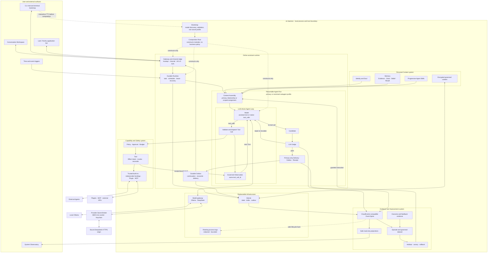
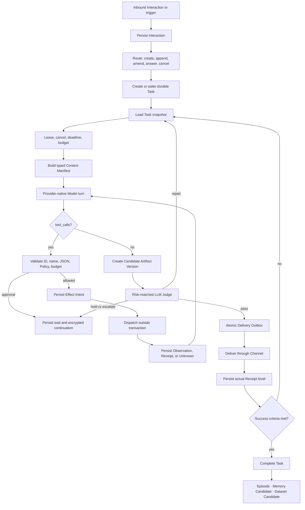

# Eri MVP Technical Design

> Status: MVP release-candidate technical baseline
> Date: 2026-07-20
> Implementation status: release gates are defined in section 24; a public tag remains separate from this source release
> This document is the single technical source of truth for the Eri MVP. See [MVP Product](./mvp-product.md) for product meaning.

## 1. Technical goals

Eri is a single-user, local-first, long-running Agent Assistant. The design must provide:

- LLM-driven open-task intelligence instead of a fixed Workflow.
- Crash recovery for tasks, scheduling, external side effects, and delivery.
- Provider-independent Identity, Soul, Memory, and relationship.
- High autonomy for low risk and deterministic non-bypassable high-risk boundaries.
- Eval before every outward delivery and lineage for posterior evidence and evaluation.
- Replaceable Memory with provenance, time, conflict, weight, restoration, and deletion.
- Cross-language, out-of-process, minimum-authority Plugins.
- One `eri` executable for ordinary use; optional helpers isolate narrower trust zones rather than turn the project into distributed services.

### 1.1 Non-goals

- Multi-tenant SaaS or distributed cluster.
- Fixed business Workflow Engine or universal Event Sourcing.
- Go dynamic-link Plugin ecosystem.
- Online mutation of protected prompts, Skills, code, model weights, or configuration outside the guarded small-instruction experiment in section 17.5.
- Voice, native desktop/mobile apps, or additional remote Message Channels beyond Lark/Feishu.
- General knowledge graph or biological reproduction of the human brain.

## 2. System invariants

No Model, Tool, Plugin, Channel, or future implementation may bypass these rules:

1. **Core owns identity.** Local Core owns Soul, user belonging, and relationship continuity.
2. **Persist before side effect.** Store normalized intent, authority, scope, and idempotency before external writes.
3. **Models have no authority.** They emit candidate text or provider-native Tool Calls; they do not grant permission, write the database, or bypass Policy.
4. **Eval before Outbox.** Every user/third-party delivery references an evaluated Artifact Version.
5. **Storage is not Memory; Memory is not fact.** Interaction, Memory Candidate, Evidence, Claim, and Belief are distinct.
6. **Provenance and version remain.** Important conclusions, Context, evaluations, and dataset samples are traceable.
7. **Deletion propagates.** Content, indexes, derived Memory, Episodes, and datasets delete or invalidate through lineage.
8. **Core does not persist credentials.** Passwords, tokens, cookies, API secrets, and capability handles never enter EriDataRoot, Context, logs, or evaluation data. Explicitly accepted durable external credentials exist only in an independent Broker's OS Keychain.
9. **Failures are honest.** No Receipt means no confirmed success. Unknown outcomes reconcile before retry.
10. **Concurrency preserves Task order.** Tasks may run concurrently; one Task's authoritative commits are version-serial.
11. **Protected boundaries do not evolve.** Soul, user sovereignty, local-first, privacy, credential rules, Memory truth, and strong approval never enter a candidate search space.
12. **Provider continuation fidelity is governed.** Preserve provider-required continuation state such as `reasoning_content` with its assistant Message inside encrypted Agent checkpoints for exact replay and inside the encrypted user-owned Run record for retention, export, and deletion. Replay it whenever that Message remains in a later provider request, including after recovery. Safe Trace projections omit it; never promote it into Delivery, logs, Observatory, Memory, Episodes, datasets, or evolution.
13. **Conversation is zero-settings and auditable.** It exposes answer-bound safe execution only; developer events and operations remain in Observatory.
14. **Subagents never face the user.** Primary Eri alone delivers and owns responsibility.
15. **Repository language is English; assistant language is contextual.** Source, tests, documentation, and UI copy are English. Runtime answers follow the user's language.

## 3. Overall architecture

Use a **domain-modular monolith + durable Event Spine + out-of-process Plugin boundary**.



The daemon outline is a deployment/trust boundary, not a giant object. Bootstrap runs before full composition, opens no Web listener, and exits its setup phase after committing a valid non-secret profile. The Provider Secret Broker is a separate narrow process even though the same executable starts it.

The online center is one recoverable Run: Gateway wakes Runtime; Runtime creates or resumes the Run; Context, Agent Loop, Eval, and Delivery compose it. Personal Context, Capability/Safety, Evidence/Improvement, and Infrastructure support the Run through explicit interfaces; none is a parallel assistant or bypass.

The invariant is:

> Agent Loop decides what to do. Runtime ensures that it is authorized, reliable, durable, and recoverable.

Understanding, planning, arbitration, Tool selection, clarification, and subagent delegation are LLM thinking. Runtime state represents execution facts, not business workflow.

## 4. End-to-end flow



There is a durable boundary before and after every external call. Raw provider tokens never stream to the user. Conversation shows factual presence and only evaluated Messages.

## 5. Processes and local communication

### 5.1 Executables

The ordinary user entrypoint is one `eri` binary:

```text
eri daemon
eri chat
eri status
eri stop
eri doctor
eri logs [--follow] [--lines N] [--task-id ID]
eri diagnose [--output PATH]
eri install
eri uninstall
```

`daemon` is long-running; `chat` is a full Channel; other commands are short-lived local clients. The same binary may start internal `provider-secret-broker` mode as a separate process. That mode is not another product entrypoint.

Google Workspace optionally builds `eri-google-workspace` and `eri-google-auth-broker`. The first is an MCP Plugin; the second is a credential trust zone. Their separation is least privilege, not distributed scaling.

### 5.2 Local API

- CLI uses an OS-user-only Unix socket.
- Conversation and Observatory use separate loopback HTTP listeners, bootstrap sessions, and permission sets.
- A trusted Adapter assigns `source_channel`; request bodies cannot self-declare it.
- HTTP handles requests and SSE handles one-way activity/event streams.
- Construction fails when a registered surface lacks its required application capability. No type-assertion 501 or empty-list fallback.
- Web never accesses SQLite, Content Store, or Core memory directly.
- Default listeners are loopback only. Remote Channels enter through explicit adapters and identity binding; Tool Plugins remain out-of-process.

### 5.3 Loopback safety

- Bind only `127.0.0.1` or `::1`.
- Establish short-lived sessions through one-time bootstrap.
- Validate Origin and require CSRF protection or a header unavailable to ordinary cross-origin forms.
- Session secrets never appear in URLs, logs, Memory, or datasets.
- Observatory has higher read/operation authority than Conversation but still uses audited Core commands.

## 6. Go structure and dependencies

Organize by stable business capability. Do not add central `core`, `ports`, `adapters`, `contracts`, `common`, `utils`, or `types` packages.

```text
eri/
├── cmd/
│   ├── eri/
│   ├── eri-google-workspace/
│   └── eri-google-auth-broker/
├── brokers/googleauth/
├── internal/
│   ├── cli/ bootstrap/ daemon/
│   ├── localapi/ channel/ channel/lark/ agui/ a2a/
│   ├── runtime/ task/ scheduler/ agent/ execution/ eval/ delivery/
│   ├── identity/ memory/ skill/ content/
│   ├── policy/ approval/ budget/ tool/ tool/builtin/
│   ├── plugin/ plugin/mcp/ subagent/ codex/ notification/ userdata/
│   ├── eventlog/ observability/ feedback/ episode/ evolution/
│   ├── model/ollama/ model/deepseek/ providersecret/ keychain/
│   └── store/sqlite/
├── api/plugin/v1/
├── plugins/
├── web/conversation/ web/observatory/
├── skills/
└── docs/
```

This is a boundary map, not a requirement to pre-create empty packages.

Dependency rules:

1. `cmd/eri` enters `internal/cli` and contains no business logic.
2. `internal/daemon` is the only full Composition Root.
3. Define interfaces near consumers and return concrete types from constructors.
4. Runtime wakes an injected Handler and does not depend on concrete Agent implementation.
5. Local API calls application capabilities and never database tables or provider implementations.
6. SQLite, Ollama, MCP, and Channels do not own Soul, Task truth, or authorization meaning.
7. Convert API, Plugin, Provider, and domain DTOs explicitly at boundaries.
8. Modules mutate only owned data; cross-module reads use narrow interfaces or read views.
9. Durable Events represent committed facts needed by multiple consumers; synchronous calls return values needed for current progress.
10. Observer, Episode builder, indexer, and evolution analysis cannot become online Task availability dependencies.

## 7. Core domain model

Use stable opaque IDs without private meaning.

| Object | Responsibility | State or relationship |
| --- | --- | --- |
| Interaction | One inbound/outbound interaction | Channel, sequence, reply-to, ContentRef |
| Conversation | Continuous relationship mapped across Channels | one authoritative user timeline in MVP |
| Task | Durable responsibility for a goal or commitment | queued, running, waiting, paused, completed, failed, canceled |
| Run | One Task execution attempt | active, succeeded, failed, canceled |
| Step | Inspectable/recoverable progress unit | model, tool, eval, delivery, wait, delegate, memory, reconcile |
| Invocation | Model, Tool, Plugin, Eval, Agent, or Channel call | planned, dispatched, succeeded, failed, canceled, unknown |
| Effect Intent | Normalized possible world mutation | planned, authorized, dispatched, confirmed, failed, unknown, compensated |
| Artifact Version | Candidate Message/file/report/plan/action summary | candidate, evaluated, approved, delivered, superseded |
| Delivery | Send attempt to a target Channel | queued, dispatching, sent, acknowledged, failed, unknown |
| Commitment | Future responsibility | active, paused, fulfilled, canceled; origin or recent-Channel routing intent |
| Memory Evidence/Claim/Belief | Source and current confidence | independent provenance and weighted status |
| Episode/Dataset Candidate | Governed replay/evaluation evidence | lineage, validity, authorization, split |

### 7.1 Interaction routing

An inbound Interaction becomes `create`, `append`, `amend`, `answer`, `cancel`, or `ambient`. Routing uses explicit reply target and pending decision first, then entity and semantic context. Ambiguity that changes side effects becomes a user question; it never silently attaches to the wrong Task.

## 8. State, Event Spine, and Content Store

### 8.1 Not universal Event Sourcing

SQLite current state is authoritative for online execution. Append-only Events provide audit, read-model rebuild, Episodes, datasets, and external protocol projection. Replaying all history is not required to start Core.

### 8.2 Atomic commit

One transaction commits current state/version, Event, and applicable Internal Outbox item. External dispatch occurs after commit. Callback or reconciliation writes the result in a new transaction. Optimistic Task version prevents dual-worker commits.

### 8.3 ContentRef

Sensitive or large bodies live encrypted in a governed Content Store. Structured records carry opaque `ContentRef`, media type, size/hash, purpose, owner, lineage, retention, and deletion state. AES-256-GCM uses per-object nonces and authenticated metadata. Keys remain outside SQLite. Logs and Events contain only safe summaries.

### 8.4 Agent Run Events and standards

Internal Event envelope is CloudEvents 1.0-compatible and includes stable ID, source, type, subject/aggregate, time, data-content type, safe data, correlation, causation, schema version, and privacy classification.

CloudEvents is the neutral fact envelope, not the domain state model. Eri-specific event types describe committed Runtime facts. An adapter projects these facts at the edge:

- **AG-UI:** conversation/run lifecycle and safe custom events for frontends. Never invent token streaming when candidates are withheld until Eval.
- **A2A 1.0:** Task, status, Artifact, and message projection for future Agent Gateway interoperability.
- **Channel gateways:** map external message IDs, order, typing/presence, attachments, Delivery, and Receipts without leaking platform fields into Core.

Preview APIs explicitly advertise safe projections, not a complete AG-UI or A2A server. Extension fields are namespaced. Causality derives from committed correlation/causation/`depends_on`, never timestamp order.

The first authenticated canonical-Conversation connection atomically commits `conversation.introduction.requested`, an ordinary queued Task, and `task.wake`. A uniqueness record makes the trigger idempotent across Web, CLI, refreshes, and restart. The Event contains safe identifiers only; the encrypted trigger asks for one or two natural greeting sentences from the current Soul and explicitly excludes capability lists, mission/relationship explanations, ceremonial promises, setup questions, and forced engagement. No adapter or client owns fixed assistant prose.

## 9. Agent Loop

### 9.1 Loop semantics

The small cognitive driver repeatedly:

1. Builds provider-visible messages from typed Context and continuation.
2. Calls the provider.
3. If `tool_calls` exist, validates each call and routes through Tool Gateway.
4. If the same native assistant Message also contains useful user-visible content, treats that content as a non-terminal progress Candidate; an LLM Judge and deterministic gates must Pass before one `continue_task=1` Delivery is atomically committed to Outbox.
5. Appends one governed Tool result with the exact original `tool_call_id`.
6. Starts the next Model Turn regardless of whether a progress Delivery was sent.
7. If no Tool Call exists, creates a terminal Candidate for Eval.

The Loop has no Eri-specific Decision JSON and no fixed model-turn or model-token budget. Eri does not send `max_tokens` to DeepSeek; Context Assembly may reserve capacity inside the advertised provider window, but that reservation is not an output ceiling. The Loop stops on evaluated delivery, cancellation, approval wait, unrecovered provider failure, deadline, provider context/account limit, device limit, or a governed no-progress condition. These are Runtime conditions, not a hardcoded maximum number of cognitive iterations. When no-progress fires after confirmed Tool evidence exists, Runtime performs exactly one Tool-disabled synthesis Turn over that evidence before failing; the terminal wrapper retains the underlying cause for diagnosis.

The user may add Messages while the Loop is active. Runtime persists them first, associates them with the dispatched Task, and admits each ordered Message at the next safe Turn boundary. It does not splice text into a provider request already in flight or concatenate Messages into a synthetic instruction. A completed model response based on an older input sequence becomes a non-actionable `superseded` Trace record when none of its Tool Calls crossed an Effect boundary. Ordinary input does not auto-cancel that request: cancellation cannot recover its input-token cost and repeated restarts can waste more tokens. Prefix caching reduces repeated context cost on the resumed Turn. The explicit Task Cancel control, deadlines, and resource policy remain separate durable interruption paths and may cancel provider work when the adapter supports it.

A provider-native Tool Call batch is one protocol frame: the assistant Message and exactly one `tool` Message for every declared `tool_call_id` must remain contiguous before another user, system, or assistant Message. Before the first Tool starts, a stale frame may be removed completely. After any governed Tool Result exists, Runtime preserves the assistant frame and completed Results, emits a governed `superseded_before_execution` Tool observation for every unstarted sibling, then appends the newer user Message. The skipped observation is internal protocol state, never fixed user-facing copy. Every completed Tool Result advances the encrypted `model_received` checkpoint with only the remaining calls pending. Recovery may replay an already-durable Effect despite a newer input watermark, but the watermark still rejects creation of a new stale Effect. Before every provider call, Runtime validates that no Tool Result is orphaned, duplicated, undeclared, or missing.

`interactions.sequence` is the MVP input watermark. Model Turn Trace records the sequence it saw. Artifact, progress Delivery, and Effect Intent transactions compare their basis sequence with the newest inbound sequence; a mismatch returns control to the same Loop before any stale result crosses an effect or delivery boundary. If the terminal commit wins first, the invocation is no longer joinable and a later Message starts the next Task in the same Conversation.

Progress is not a separate Workflow step or hardcoded timer reply. The model decides whether a material update is useful while making a native Tool Call. Runtime independently evaluates it, deduplicates its content hash, persists Artifact/Eval/Delivery/Event/Outbox, and keeps Task and Run active. With multiple outbox lanes, Delivery can reach Web/CLI while the original `task.wake` handler continues. Empty acknowledgements are rejected by the progress Judge.

A lifecycle fact stream emits safe `loop_started`, `turn_started`, `model_completed`, `tool_requested`, `observation_committed`, `checkpoint_committed`, `candidate_created`, `evaluation_completed`, and `loop_stopped` facts. It cannot affect decisions and contains no private reasoning.

### 9.2 Native Tool Calling

Provider adapters normalize only provider syntax. A call must have stable call ID, registered Tool name, valid JSON arguments, and supported schema. The model never sees or chooses an approval token. Tool Results are governed observations; a return value alone is not proof of an external side effect—Receipt semantics determine confirmation. Runtime owns Tool Call frame closure and checkpointing; provider adapters never repair malformed transcripts implicitly.

Multiple sibling read-only calls may execute concurrently when the Tool declares independence and result order remains provider-correct. Side-effecting calls remain ordered by explicit dependency and authorization.

### 9.3 Planning and arbitration

Planning is ordinary model reasoning. For decisions such as travel, the model expands dates and combinations, uses Tools for evidence, scores dimensions, keeps Pareto/high-ROI candidates, and recommends. Runtime does not encode travel or purchase workflows.

### 9.4 Context compaction

Compaction is automatic before provider context overflow and can also create persistent conversation summaries after safe checkpoints. It preserves the current objective, unresolved commitments, approvals, Tool call/result pairs, citations, critical constraints, user corrections, and Artifact/Receipt facts. It prunes redundant observations and old verbose bodies through ContentRef summaries.

Compaction creates a versioned summary with source range, model/provider, token estimate, checksum, and validation record. It never summarizes credentials or private reasoning. A failed compaction leaves the previous context valid. Context manifests expose which summaries and records were sent externally.

## 10. Context, Identity, and Model Gateway

### 10.1 Identity and Soul

Identity stores an immutable Soul source, versioned operational projection, relationship context, and user-owned profile. A Model request always receives the stable Soul boundary before task-specific instructions. Evolution cannot modify it.

### 10.2 Context priority

Build typed Context in this order:

1. System safety and authority boundary.
2. Identity/Soul.
3. Current Task, success criteria, and durable continuation.
4. Relevant conversation and attachments.
5. Retrieved governed Memory.
6. Activated Skill instructions/resources.
7. Available Tool schemas.
8. Guarded evolution instruction.

Each item records source, purpose, privacy, token estimate, and whether it is sent to an external model. Untrusted files and Web content are clearly delimited as data and cannot redefine authority.

Prompt text is compiled by purpose, not accumulated into one universal instruction. The primary generation prompt contains the immutable Soul plus only cross-capability Agent Loop and response rules. Capability-specific selection and operating guidance lives with the currently available Tool description and Schema; an unavailable Tool never leaves dormant instructions in the base prompt.

The provider-visible physical order is cache-aware without changing the authority priority above: a byte-stable root System contains the Agent kernel, Soul, and stable Skill catalog; durable Conversation messages or a Context checkpoint follow; activated Skill instructions, guarded evolution, retrieved Memory, and date-only Runtime facts form a late dynamic suffix; a Runtime-owned Current Task Capsule, Task Objective, and Current Step close the initial request. The System-role capsule contains only durable Task/source Interaction identity and event or scheduled Commitment facts when applicable. An event-created Task records the typed event, its occurred state, and its `fulfillment` execution phase. For that fresh fulfillment Run, Context Assembly projects only the stored event objective and its source Interaction from Conversation history; unrelated Conversation frames remain authoritative local evidence but are not provider input or executable instruction. Separately governed Memory and Skills may still enter through their ordinary evidence boundaries. Runtime also removes the source registration capability from that phase, so a due Commitment cannot recreate, update, or extend itself through `builtin.commitments`; a new schedule requires a user instruction after this fulfillment. The objective body is a separate pinned Message that preserves the source Interaction's `user` or `system` role; Runtime never launders user text into System authority. This task frame remains in Agent checkpoints and survives Tool turns, recovery, and compaction while the Task is active. Later user turns amend the active Task and receive a refreshed Current Step. Terminal Tasks leave default model context; their outcomes remain Events/Episodes and only separately governed durable facts or preferences may enter Memory.

Exact timestamps remain in Task, Event, Invocation, Delivery, and Receipt records. The general model suffix exposes local calendar date and timezone, not a per-request wall clock. A scheduled Task additionally exposes its exact `scheduled_for` because that timestamp is causal task state. For a relative one-time request, the Commitments Tool accepts `after_seconds` and Runtime resolves it once against its trusted clock into an absolute persisted `at`; the model does not search for or infer the current wall clock. Provider-specific cache controls may add explicit breakpoints, but cache state is never required for correctness.

Eval never inherits the generation system prompt. A final or progress Judge receives its own short, purpose-specific rubric, the exact transcript, activated Skill evidence, confirmed Tool IDs, and a bounded Candidate Evaluation Context containing the Run's Soul, relevant governed Memory, and trusted Runtime facts. It does not receive Agent operating rules, the general Skill catalog, capability instructions, or the guarded evolution candidate it is judging. This prevents role conflicts and keeps online experiments independent from their evaluator. Checkpoints persist this bounded context; when migrating an older checkpoint that lacks it, Runtime reconstructs only the immutable Soul, neutral Memory evidence, and recorded Runtime facts, never legacy generation instructions.

Prompt tests enforce these ownership boundaries and a compact default-kernel ceiling. Length is a regression signal, not proof of quality; release decisions still require behavior and real-model Eval across completion, false-success, clarification, privacy, Tool use, style stability, input tokens, and cache hits.

### 10.3 Context budget

Reserve space for system/Soul, current objective, pending Tool round, and answer. Select history, Memory, Skills, and Tool schemas by relevance and value. Trigger compaction before overflow. Capability discovery comes from the real provider, never a silent 32K fallback.

### 10.4 Model Gateway

The consumer contract exposes provider-native Messages, Tools, response, usage, capabilities, and cancellation. Providers declare context window, vision, native Tool Calling, cache behavior, max output, and supported roles. A provider lacking a required capability causes explicit setup or task failure.

Ollama is default local. DeepSeek is optional and accessed either through environment for development or the isolated secret Broker for normal operation. The cost-efficient cloud binding is the official `deepseek-v4-flash` model ID. Model IDs and endpoints are configuration, not compiled business logic.

### 10.5 DeepSeek cache and cost

Keep the reusable request prefix byte-identical: the stable root System and durable Conversation/checkpoint precede late Memory, date/channel facts, and active Task framing. Tool schemas remain provider-native request fields and stable ordering is deterministic. Do not place a seconds-level current clock in the root System. Record provider-reported `cache_hit_tokens` and `cache_miss_tokens`; cache is best-effort, never correctness state. A live two-request probe validates that a stable prefix can hit before accepting a cache-sensitive release claim. DeepSeek thinking remains enabled for native Tool Calls, Judge, comparison, compaction, and structured synthesis. The adapter captures each assistant `reasoning_content` field beside its Tool Calls, persists the complete active transcript in the encrypted Agent checkpoint before Tool execution, and sends the field back on every later request that retains that assistant Message, including after recovery. At a terminal boundary, Runtime stores the final complete `ModelRequest` as a distinct `provider_transcript` inside the encrypted user-owned Run record. Observatory decodes only the safe Trace fields and ignores that transcript; data export and complete erasure retain their ordinary user-owned Content lineage.

Reflection is not a separate Runtime, service, or Workflow. Inside a Run it means a model reorients after repeated evidence or performs a bounded structured analysis. Provider-required continuation state stays attached to the encrypted model transcript for exact replay; Eri exposes and promotes only the resulting instruction, finding, or summary.

Model, Judge, repair, subagent, and compaction usage is attributed to its Task and recorded without prompts or keys. Eri does not deny a model dispatch through a Task/day/month token ceiling. Runtime instead relies on provider context/account limits, deadlines, governed no-progress recovery, cancellation, and explicit authority for background work; material external expense still requires strong approval.

## 11. Skills, Tools, and subagents

### 11.1 Agent Skills

Follow the open Agent Skills convention:

- Discover directories containing `SKILL.md`.
- Read only frontmatter `name` and `description` for selection.
- Load full `SKILL.md` after the model selects it.
- Resolve `references/`, `scripts/`, `assets/`, and templates relative to the Skill and only on demand.
- Discover only repository-bundled Skills and user-configured `~/.eri/skills`; the Eri-specific user location overrides a bundled Skill with the same name and records the conflict. Never import `~/.agents/skills`, project `.agents/skills`, workspace `.eri/skills`, or arbitrary external directories.

There is no private Skill manifest, keyword router, Skill Runtime, service, or implicit execution authority. Skill content is untrusted instruction below system/Soul/Policy. Scripts run only through ordinary Tools and authorization.

### 11.2 Tool Gateway

Registry snapshots concrete Tool ID/version/schema/risk/capability. Gateway validates arguments, Context/Task binding, Policy, Budget, Approval, Effect Intent, cancellation, timeout, result schema, and Receipt. A Tool cannot call the database or Delivery directly.

### 11.3 Built-ins

MVP includes governed file read/search/create, protected overwrite, terminal, Web fetch/search, attachments, Memory operations, Task/Commitment, notifications, feedback, user-data export/erase, delegation, and Plugin management. Built-ins are capabilities, not hardcoded task workflows or fixed user replies. `builtin.web` is registered only when `TAVILY_API_KEY` is available at runtime. Search sends the user-derived query and optional model-selected topic, recency, and domain constraints to Tavily Search; fetch sends the selected public URL to Tavily Extract and returns readable Markdown. The key remains in process memory, the endpoint is fixed in production, private or credential-bearing fetch URLs remain denied, cross-origin credential redirects are denied, and transient provider failures receive bounded retries. Zero usable search results and empty extraction are explicit failures rather than confirmed evidence. There is no HTML-search-engine scraping fallback.

### 11.4 Subagent delegation

`builtin.delegate` is the only model-facing delegation Tool. Its schema exposes `assignee`, objective, scoped Context, and requested workspace authority. The `assignee` enum and routing guide are generated only from available Role Descriptors. They contain ordinary job descriptions, never provider IDs, CLI details, foreground/background terminology, capability IDs, boundary IDs, runtime handles, or Tool allowlists.

The contract has three explicit layers:

- **Role Catalog:** stable model-readable jobs. `intern` handles clear, low-risk, routine work that takes time: gathering, organizing, comparing, checking, and summarizing information. `engineering_team` handles project, code, or data investigation, analysis, implementation, debugging, and verification, from small jobs to complex engineering work.
- **Provider Registry:** Runtime-only implementations such as `eri_native` and `codex`, with supported roles, execution mode, capabilities, access modes, external-data behavior, recovery behavior, and hard boundaries. Future installations may register `claude_code`, `pi_agent`, or another compatible implementation.
- **Binding:** an explicit `role_id -> provider_id` choice. Registry resolves it once during Tool Prepare and freezes both IDs in the encrypted normalized payload. Invoke and Inspect must use that frozen pair; there is no silent fallback or rebinding.

The effective authority is the intersection of the active Eri Intent and Policy ceiling, the Role request, Provider Descriptor, and provider enforcement. Delegation can only narrow authority. Every subagent receives one objective and minimum scoped Context. The baseline boundaries deny direct user contact, approval, Delivery, Soul or Memory write, recursive delegation, authority expansion, and ungoverned external side effects. Primary Eri remains accountable and receives subagent output only as untrusted evidence.

Providers implement one Prepare/Invoke/Inspect contract. Both initial roles are background work and return a common durable Ticket before later committing a terminal Result. Registry rejects execution-mode mismatch, undeclared external disclosure, unsupported access, read-only elevation, or role/provider identity mismatch. Model-visible Ticket and Result identify the `assignee`; Runtime records both `role_id` and `provider_id`. The terminal Result shape is `delegation_id/assignee/status/summary/evidence/changes/tests/remaining_risks/error_code`.

`intern -> eri_native` uses the same `loopDriver` as primary Eri: provider-native model turns, Tool Calls, governed Observations, context compaction, usage accounting, no-progress detection, checkpoints, Trace, cancellation, and recovery. It uses a restricted Agent profile rather than a second Agent Loop. Its Context contains only objective and explicitly supplied scoped material, not the primary Conversation, Soul response profile, or personal Memory. Its Tool view contains only bounded file, terminal, and Web capabilities; Gateway applies a Runtime-injected read-only Effect ceiling after Tool Prepare and before payload or Effect Intent persistence. Delegation, notification, Memory, feedback, user-data, Task, Commitment, Plugin-management, and approval surfaces are absent. Its completion sink writes the common private subagent Result and Event; it cannot create a user Artifact, Delivery, or Channel message.

`engineering_team -> codex` uses the user's healthy local Codex executable. Codex is one External Agent Provider bound to that role, not Eri's job description. It supports `read_only` and `workspace_write`; write access is reversible but overwrite-capable and therefore requires ordinary confirmation. It cannot commit, push, deploy, change credentials, or communicate externally. If Codex is absent, `engineering_team` is not advertised; another explicit configured binding may provide the same stable role.

The Codex Provider uses `codex exec --json` with an output schema, explicit sandbox, non-interactive approval policy, ephemeral session state, and prompt input over stdin. Core reuses existing Codex authentication but never copies or persists it. Raw JSONL, private reasoning, stderr, and Tool detail are not retained; only the bounded common Result enters encrypted governed Content.

A background Provider returns its durable deferred fact only after the Effect Intent and `subagent_runs(role_id, provider_id, ...)` record commit. Primary Eri then produces an evaluated progress Artifact. The Task moves to `waiting`, and that progress Delivery must be sent before a terminal `subagent.completed|failed|unknown|canceled` Event can claim the encrypted primary continuation. Runtime verifies delegation ID plus frozen role/provider binding, resumes the same Task and Run, injects structured untrusted evidence, and primary Eri reviews and delivers through ordinary Eval and Outbox.

The native Intern has its own encrypted `runtime_state_ref`, separate from the primary continuation. Recovery re-enters the shared Loop from `ready_for_model`, replays an idempotent confirmed Tool call from `model_received`, or commits the saved candidate from `candidate_received`; it never repeats a confirmed Tool effect as new work. Codex interruption never blindly replays a possibly mutating process. A known orphan is stopped and recorded `unknown`; `starting` without a trustworthy handle is also `unknown`. `ERI_CODEX_PATH` may select an executable and `ERI_CODEX_TIMEOUT` bounds wall time; otherwise composition probes PATH and the packaged desktop CLI.

The supporting surface analysis is recorded in [Local Codex External Agent integration](./research/codex-subagent-integration.md).

## 12. Durable Runtime

### 12.1 Task state

Task transitions are explicit and versioned. `waiting` records why and what can resume it: user decision, approval, time, external event, provider recovery, or reconciliation. Completion requires all critical Effects and Deliveries to be resolved.

### 12.2 Concurrency

Bound global workers and per-provider/plugin concurrency. One lease owns a Task version at a time; leases renew and expire durably. A canceled Task cannot schedule new side effects. Different Tasks may advance concurrently while the authoritative Conversation sequence remains monotonic.

There is at most one joinable foreground Task for the canonical Conversation. `CreateInbound` joins a Task only while its primary model invocation is `dispatched`; queued, waiting, completed, and failed work is not silently reopened. The existing interaction row is the durable attention mailbox, and its monotonic sequence is the input revision—no process-local queue is authoritative. Agent Loop reloads later inbound rows before model, Tool, Eval, progress, and final commit boundaries. Joined inputs remain separate ordered user Messages.

This is a functional analogy to human interruption handling, not a claim to reproduce neurobiology: preserve the incoming signal, interrupt at a task boundary where possible, retain a resumption cue, and reorient before acting. Controlled studies report higher disruption when interruption occurs mid-task rather than at a boundary, a measurable resumption lag, and fewer resumption errors when people take time to reorient ([Bailey and Konstan, 2006](https://www.sciencedirect.com/science/article/pii/S074756320500107X); [Foroughi et al., 2016](https://pubmed.ncbi.nlm.nih.gov/26882286/); [Brumby et al., 2013](https://pubmed.ncbi.nlm.nih.gov/23795978/)). Eri's durable checkpoint is the resumption cue; the input fence is the stronger machine-specific guarantee that a stale cognitive result cannot act.

### 12.3 Commitments and scheduling

A Commitment records objective, schedule/event trigger, next fire time, delivery-route intent, budget, and consent evidence. A user clarification updates the existing non-terminal Commitment and its next fire time rather than creating an overlapping schedule. `origin_channel` is used when the user explicitly requests a reminder: Runtime freezes the trusted creating Channel and any durable remote reply target. `recent_channel` is used for Eri-proposed ongoing work after user consent: every fire resolves the latest accepted inbound user Interaction and uses its trusted Channel; a remote Channel keeps its conversation target but starts a proactive Message rather than replying to an unrelated old Message. The Model may select only this routing intent and cannot supply a Channel or platform identifier.

Each fire atomically records its resolved Channel and remote conversation target beside the created Task and emits them as safe routing facts in the Event Spine. Delivery retries and receipt commits use that same frozen per-fire target even if the user later talks elsewhere. Each fire creates a Task. The stored trigger retains system provenance. Context Assembly projects its ContentRef, typed `commitment.due` event with `occurred` state, and `commitment_id/scheduled_for` facts into the active Task Capsule and places a Current Step after late dynamic context; it never rewrites the trigger as user-authored history or treats the request that registered it as unfinished work. The capsule persists through Agent checkpoints and is re-pinned after compaction until the Task becomes terminal, so unrelated conversation cannot replace the scheduled objective. Timezone changes are handled explicitly. Scheduler survives restart and does not infer commitment from an ignored suggestion.

### 12.4 Resource limits without a turn cap

Provider context and account limits, wall deadline, concurrency, output capacity, storage, device load, cancellation, and no-progress evidence remain enforceable. Eri adds no fixed Task/day/month model-token ceiling and no fixed Agent Loop turn count. Waiting work consumes no active worker. Provider exhaustion pauses or asks rather than silently looping.

### 12.5 Cancellation

Cancellation is durable and checked before model dispatch, Tool dispatch, retry, Eval, and Delivery. In-flight non-cancelable effects move to Unknown/reconciliation rather than false canceled. Cancel and model-return races use optimistic versioning.

Ordinary Conversation input is not cancellation. It is a soft interruption that marks the active input revision dirty and waits for the current atomic provider call to return. Runtime fences an unacted response as `superseded`; if a Tool batch partially crossed the durable boundary, it truthfully closes that protocol frame before resuming with the newer revision. This accepts one possibly wasted completed model call while avoiding cancel/retry thrash, malformed Tool transcripts, duplicated Effects, and unpredictable repeated input charges. The explicit Task Cancel control remains user-directed and durable; provider adapters may stop in-flight work when they support cancellation, while Runtime still checks the request at every safe boundary. Future provider streaming may stop stale generation early, but it cannot weaken the same durable revision fences.

## 13. Side effects, idempotency, and recovery

### 13.1 Classification

- Pure read: repeatable within privacy and cost limits.
- Local reversible write: still intent-backed when it changes user state.
- External reversible write: intent, idempotency, Receipt, optional compensation.
- Irreversible/high-risk: strong approval and exact binding.

### 13.2 Effect Intent

Intent stores Tool/version, normalized target, argument hash, task/run/invocation, risk, approval reference, idempotency key, dependency, dispatch attempt, and result/Receipt references. Persist before dispatch. Tool-specific reconcilers query provider state by idempotency or external ID.

### 13.3 Crash recovery

- Planned, never dispatched: safely dispatch after current authorization check.
- Dispatched with Receipt: commit confirmation idempotently.
- Dispatched without result: mark Unknown and reconcile; never blindly replay.
- Approval wait: restore encrypted exact continuation; approval remains bound and expires.
- Candidate evaluated but Outbox absent: transaction invariant prevents this state.
- Outbox queued: retry logical delivery with stable idempotency until confirmed/terminal.

## 14. Policy, Approval, and Budget

### 14.1 Decision layers

1. Deterministic hard deny for credentials, invalid authority, protected deletion, and unsafe schema.
2. Model proposes action; it does not authorize it.
3. Policy classifies risk and decides autonomous, confirmation, strong approval, or refusal.
4. Runtime rechecks immediately before dispatch.

### 14.2 Control levels

Autonomous covers low-risk reversible in-scope actions. Ordinary confirmation covers meaningful preference/commitment or Plugin authority expansion. Strong approval covers payment, legal/public commitment, secrets, destructive operation, account security, or major loss. Refusal is narrow and product-defined.

Approval binds user, Task, Run, Tool/version, normalized target, argument hash, content version, amount, risk, and expiry. It is single-purpose and cannot be reused by a subagent or retry with changed parameters.

### 14.3 Data egress and cost

Context Manifest records every external recipient and sent category. Policy may minimize or block external data. Provider-reported usage is attributed after each response and remains observable without becoming a pre-dispatch token ceiling. A provider failure cannot erase already recorded usage evidence.

## 15. Memory

Memory is a replaceable component behind a consumer contract; its durable semantics remain stable even when retrieval implementation changes.

### 15.1 Functional kinds

- Episodic: dated events and interactions.
- Semantic: durable user facts, preferences, and world Claims.
- Procedural: Skills and learned working methods, kept distinct from factual Belief.
- Prospective: commitments and future intentions, owned by Runtime/Scheduler but retrievable as context; Memory is not their authoritative task queue.
- Working: per-Turn and active-Task Context, not automatically long-term Memory. A terminal Task may yield a governed Episode or independently promoted durable Claim, never a verbatim Current Task memory.

### 15.2 Evidence, Claim, and Belief

Evidence stores original source reference, time, source identity/type, independence group, directness, reliability, extraction version, and deletion lineage. Claim is a normalized proposition with subject, predicate, object/condition, temporal validity, privacy, and usage policy. Belief aggregates supporting and contradicting Evidence into status and confidence without deleting history.

Statuses include candidate, active, contested, superseded, expired, and do-not-use. Explicit user statements may pin; inferred Claims require independent evidence before promotion.

### 15.3 Weighted update

Do not count repeated copies from one source as independent. Weight direct user correction, primary records, verified provider Receipts, independent sources, recency, and context applicability. Contradiction lowers confidence or narrows conditions; strong later evidence can restore a Claim. Never use last-write-wins for truth.

### 15.4 Read path

1. Filter by user, usage policy, privacy, validity, and task purpose.
2. Generate candidates through lexical, embedding, entity, temporal, and associative retrieval.
3. Rerank by relevance, confidence, source diversity, recency, salience, applicability, and token cost.
4. Return governed Statements plus Evidence summary and Belief state.
5. Context assembly decides injection and external sending separately.
6. Runtime records `retrieved`, `injected`, `applied`, and `sent_to_external_model` independently.

Retrieval is not application. Only explicit influence on response content, Tool parameters, planning constraints, or a user-confirmed decision reinforces use. Retrieved noise decays instead of self-amplifying.

The MVP candidate generator unions keyed lexical matches, one-hop associations, and cosine similarity from a local Ollama embedding model. Statement and vector bodies are encrypted Content objects; SQLite keeps only governed metadata and opaque references. A bounded lazy backfill indexes eligible Memory after an embedding model is installed or changed. Reranking uses the stronger of lexical and semantic query relevance before existing confidence, scope, freshness, and salience factors, preventing the two representations from double-counting one match.

Semantic encoding is local even when DeepSeek supplies chat completion. If Ollama exposes no installed model with embedding capability, semantic recall is explicitly disabled and lexical/associative recall remains available. Eri never silently sends private Memory to a cloud embedding endpoint.

### 15.5 Write and consolidation

Interaction may create a Candidate, never an unquestioned fact. Extract Claims after completed exchanges and explicit events, deduplicate by meaning/source, link Evidence, and promote under policy. Consolidation merges representations without erasing Evidence or conditions. Salience and association decay gradually; pinned user Memory remains until changed or deleted.

### 15.6 Correction, deletion, and export

Correction determines factual error, real-world change, or context restriction and retains the evidence trail. `do_not_use` immediately blocks retrieval. Strong deletion removes bodies and indexes and invalidates derived Episodes, Dataset Candidates, frozen snapshots, and cached projections through lineage. Export includes human-readable Claims plus provenance and machine-readable records.

### 15.7 Provider contract

Consumer operations cover propose Evidence/Claim, retrieve with purpose and external-use flag, record application, correct, restrict, delete, export, consolidate, and inspect. Provider implementations cannot silently change truth-update or deletion semantics.

## 16. Artifact, Eval, and Delivery

### 16.1 Artifact

Candidate body and attachments are versioned. Repaired content creates a new version. Every delivery points to the exact evaluated version.

### 16.2 Eval

A deterministic pre-gate checks schema, credentials, authority, approval, cost-bearing side effects, and Receipt invariants. Then a general LLM Judge reconstructs the whole conversation arc and evaluates semantic completion, factual support, Tool/Receipt consistency, Skill method, risk, clarity, interpersonal meaning, Soul/delivery style, and whether the message honestly distinguishes draft from action. Runtime does not encode task-domain or emotional `case-when` replies.

Judge output is typed finding/severity/evidence/result: Pass, Repair, Hold, or Escalate. There are no task-specific case-when replies. Judge usage is observable without exposing full prompts.

### 16.3 Repair

Repair returns findings and governed evidence to the same Agent Loop as a new Turn. `ERI_MAX_EVAL_ATTEMPTS` is a repair fuse, not a Loop turn limit. Fuse exhaustion creates Hold/Escalate or honest failure; it never sends the rejected candidate.

### 16.4 Delivery Outbox

Eval Pass, final Artifact state, and Outbox entry commit atomically. Channel adapters use stable logical delivery ID, map platform Receipt levels, and reconcile Unknown. A sent message is not acknowledged until the platform proves it.

System approval/runtime cards are structured `role=system` records from committed fields and a deterministic safety gate. They never impersonate Eri prose or contain a fixed conversational reply.

### 16.5 Posterior outcome

Link Delivery to explicit correction, adoption, rejection, provider outcome, and user feedback. Silence is unknown, not approval. Feedback can invalidate old Episode/Dataset records and create a replacement candidate with lineage.

## 17. Observability, Episodes, datasets, and evolution

### 17.1 Data layers

1. Redacted structured logs for diagnosis.
2. Durable Events and execution facts.
3. Encrypted governed bodies referenced by ContentRef.
4. Safe Conversation projection.
5. Developer Observatory projection.
6. Governed Episodes and datasets.

One thin lifecycle fact stream feeds log, Trace, Observatory, and tests. One sanitized `slog.Record` fans out to a readable foreground terminal sink and a rotating JSON file sink, so the terminal and persisted evidence cannot drift. Sinks cannot affect Agent decisions.

### 17.2 System Observatory

Observatory displays component health, queue, provider/cache/usage, Run causality, Agent Loop Turns, Tool/Approval/Observation, Memory use, Eval, Delivery, Episode, dataset, and evolution state. It redacts credentials, private reasoning, full prompts, user Message bodies by default, and ungoverned Tool Results.

### 17.3 Episode

An Episode is replay metadata for one Task/Run: objective/success criteria, input/content references, Context Manifest version, model/tool/Skill/Policy versions, safe lifecycle facts, Artifacts, Eval, Receipts, feedback, outcome, and deletion lineage. Building an Episode is asynchronous and cannot block delivery.

### 17.4 Dataset governance

An Episode becomes a Dataset Candidate only after purpose and user authorization. Promotion requires redaction, deduplication, labeling, quality review, leakage check, lineage, split assignment, and frozen checksum. Training and holdout cannot share an origin or derived duplicate. Deletion invalidates snapshots that reference the content.

### 17.5 Guarded online evolution

At least six eligible failure signals create a candidate experiment. Keep generation evidence separate from unseen holdout. Candidate scope is a small runtime instruction outside protected boundaries. An independent Judge compares candidate to baseline offline.

Release routing uses stable `release_id + task_id` hashing: a Canary receives approximately 20%; other Tasks use Active or baseline. The first non-Pass retires the Canary. Eight online Pass outcomes promote it and retire the previous Active. Every decision retains evidence and supports manual rollback. Evolution instructions are retrieved only through `InstructionForTask(ctx, taskID)` so routing cannot drift within a Task.

No candidate modifies Soul, authority, credentials, Memory truth rules, code, model weights, or an in-flight Task. Offline gain is experiment evidence, not a real-world intelligence claim.

## 18. Plugins and external authorization

### 18.1 Trust zones

Built-ins are trusted project code. Installed MVP Plugins are explicitly trusted local executables but out-of-process. Manifest permissions are Eri authorization, not an OS sandbox. Install/upgrade requires strong approval until real OS isolation exists.

### 18.2 Manifest and lifecycle

A local Manifest declares schema version, Plugin ID/version, executable/arguments, MCP stdio transport, Tools, minimum permission/Scope per Tool, non-secret literal environment, credential endpoint environment names, health check, and upgrade requirements. Core validates path, hash/version, authority expansion, and health. Failed upgrade rolls back the previous installed version.

Plugin environments use a clean allowlist and never inherit arbitrary daemon environment or issuer endpoints. Observability records version, call, authority, health, and Receipt without secrets.

### 18.3 Host protocol and MCP

Cross-process authorization DTOs live in `api/plugin/v1` and are version-negotiated from their first release. MCP adapts tool discovery and invocation; it does not define Eri's authority, Task, Effect, or Receipt semantics. Tool results re-enter Core as untrusted observations.

### 18.4 Google Workspace Auth Broker

`eri-google-auth-broker` uses Google Desktop OAuth, PKCE, offline access, and macOS Keychain. It exposes two separate `0600` Unix sockets:

- Issuer socket available only to Core: issue one-time Task/Run/Invocation/Scope-bound handles.
- Redemption socket available only to the Plugin: redeem a handle for a short access token, query authorization status, and disconnect.

The Plugin never receives the issuer endpoint; Core never receives refresh/access tokens. Broker LaunchAgent stores executable, client JSON path, socket paths, callback, and EriDataRoot—never client-secret content or tokens. Disconnect first revokes Google and deletes the Keychain grant, then Broker uninstall removes the service.

### 18.5 Channels

Channel adapters authenticate sender binding, deduplicate external message IDs, preserve ordering/reply relationships, normalize attachments, publish presence only when supported, and map Delivery Receipts. Channel-specific DTOs do not leak into Conversation or Task domains.

The first formal adapter is an owner-bound Lark/Feishu self-built application bot. `internal/channel/lark` uses the official `github.com/larksuite/oapi-sdk-go/v3` client and WebSocket long connection. It accepts only `p2p` events from the configured owner Open ID, serializes arrival through the authoritative Conversation ingress, and atomically records the platform message ID, chat, sender binding, reply relationship, Interaction, Task, Event, and Outbox wake. A repeated platform message ID returns the original Interaction without creating duplicate work. Text, images, and files become encrypted governed Content before Context assembly.

Outbound Lark delivery starts only from an evaluated durable Outbox record. The adapter uses the Delivery ID as the platform UUID idempotency key, replies to the triggering platform message when available, maps assistant Markdown to a native `post` containing a governed `md` node, uploads governed attachments, and commits the returned Lark message ID as the actual Receipt. Unrecovered Runtime disclosures never forward their internal JSON, codes, or correlation IDs. Missing or incomplete platform evidence is a failure, never a synthetic success.

The first slice accepts App ID, App Secret, initial owner Open ID, and Feishu/Lark domain selection only from the foreground process environment. After an explicitly bound owner has produced durable accepted inbound channel records, restart may recover that owner only when exactly one distinct historical inbound sender exists; no sender or ambiguity fails closed and requires the explicit owner again. Core keeps the App Secret and SDK tenant access tokens in memory and excludes identifiers and authentication bodies from logs and diagnosis. It never reads Lark CLI state, writes credentials to EriDataRoot, or copies them into a launchd plist. Persistent unattended Lark startup is intentionally unavailable until an independent Channel credential broker owns the App Secret. See [Lark Channel setup](./integrations/lark.md).

## 19. Credentials and local data

### 19.1 No credential persistence in Core

Reject credentials from Content, Memory, Event, log, Episode, dataset, export, and model Context. Detection occurs at ingress, before storage, before logging, and before external model egress. Errors redact authentication bodies.

Provider Secret Broker reads/writes only its Keychain item and proxies HTTPS to the configured origin. The API key never enters model configuration, EriDataRoot, SQLite, launchd plist, command arguments, or Core memory.

### 19.2 EriDataRoot

The default `EriDataRoot` is the current workspace's ignored `.eri/` directory. It is the single lifecycle boundary for all non-credential persistent and runtime data: non-secret configuration, SQLite, encrypted Content, indexes, Plugin state, Episodes, datasets, backups, export staging, runtime sockets, and persistent rotating logs. Keep each category in its own subdirectory and protect the root and subdirectories with owner-only permissions. `ERI_DATA_ROOT` remains an explicit development or deployment override.

The repository must ignore `.eri/` as a whole so ordinary Git operations cannot include local state. Credentials, OAuth grants, API secrets, and Content master keys are the deliberate exception to project-local storage: they remain in process memory or a narrow OS Keychain Broker and never enter `EriDataRoot`.

### 19.3 SQLite and encryption

Use `modernc.org/sqlite`, WAL, foreign keys, busy timeout, explicit transactions, and the first public schema `user_version = 1`. Encrypt governed bodies separately; database indexes contain minimum safe metadata. On shutdown/checkpoint, preserve durability. Before the MVP ships, there is one authoritative schema shape: changes replace it directly, startup rejects stale development databases, and developers reset them instead of adding migration, dual-read, or compatibility code.

### 19.4 Backup and restore

Backup is an explicit user action and includes schema/version manifest, SQLite consistent snapshot, encrypted Content, and required wrapped key material without OS Keychain secrets. Restore validates integrity and version before replacement and never partially merges authoritative identity.

### 19.5 Logs and prompt injection

Structured logs include time, level, component, operation, Task/Run/Invocation correlation, stable error code, latency, usage, and safe fields. They include startup, listener readiness, provider/cache/usage, Task claim/state, model dispatch/finish, Tool intent/dispatch/result/reconcile, approval, Eval, Outbox/Receipt, Memory retrieval/application, scheduler, Plugin, and shutdown.

Logs never include credentials, prompts, Message/attachment bodies, raw Tool Results, personal identifiers, Keychain output, or authorization URLs containing secrets. Runtime logs rotate with bounded size and retention. `doctor` reports the log paths and last startup diagnostic. `eri logs` tails the redacted daemon log and may filter by Task ID. `eri diagnose` writes a `0600` bounded ZIP containing a manifest, safe non-secret configuration, doctor output, and allowlisted redacted process logs; it excludes SQLite, Content Store objects, Messages, prompts, Tool bodies, and secrets and asks the user to review before sharing.

Web, file, email, and Plugin content is untrusted data. System/Soul/Policy instructions outrank it. Tool Calls still pass Policy even when content asks to ignore safeguards. External text cannot install a Skill or Plugin, approve, disclose credentials, or alter Memory truth rules.

### 19.6 Export and complete erasure

Export creates an encrypted ZIP or governed archive with user-readable data, machine records, lineage, and manifest, excluding Keychain credentials. Complete erasure requires strong approval and a content-free confirmation delivery first, then stops new work, waits/cancels safe boundaries, disconnects capabilities as authorized, deletes Conversation, Content, Memory, Tasks, Artifacts, Eval, Delivery, Effect, Approval, Commitments, Episodes, datasets, Events, and indexes, checkpoints WAL, and runs `VACUUM`.

Retain only a minimal receipt with job ID, status, object counts, and time—no user text, Prompt, filenames, or ContentRef. State honestly that offline backups or user-copied exports cannot be remotely erased.

## 20. Conversation Workspace contract

Conversation is the primary no-settings frontend: iPhone-like authoritative Timeline plus a wide Run workbench, Profile/Presence, search, attachments, and Composer. All results arrive in the Timeline.

### 20.1 Structure and safe Run projection

- Profile header places avatar, `Eri`, and Presence on one row.
- Desktop Timeline width is `clamp(370px, 28vw, 430px)`; narrow screens use a full-screen same-page Run drawer.
- No history sidebar, Task page, Artifact panel, Settings, global Memory, Plugin, or subagent page.
- Conversation session exposes only `GET /api/v1/activity` and `GET /api/v1/traces/{task_id}` for safe observation.

Stable projection:

```text
RunSpan
  id, parent_id, kind, lane, title, description, status
  started_at, ended_at
  depends_on[]            # only causal drawing facts
  links[]                 # non-blocking support/retry/resume relation
  safe metadata
  memory?: MemoryRetrievalRecord

Agent Loop
  compound span: kind=agent_loop, compound=true, focusable=true
  nested metadata: loop_id, iteration_id, iteration_ordinal, trigger
  AgentIteration: stable turn id, ordinal, trigger, status, checkpoints[]
  Tool/Approval: explicit model_turn_id, tool_call_id, intent_id
  Eval: explicit model_turn_id, attempt, result

MemoryRetrievalRecord
  checked, retrieved_count, injected_count, applied_count, external_sent
  items[]:
    memory_id, claim_id, governed statement
    belief_status, confidence, lifecycle_status, usage_policy
    stages[]: stored, retrieved, injected, applied, sent_to_external_model
    safe source summary
```

`depends_on` is the sole causal edge source. Missing dependencies remain isolated or mark projection incomplete. Never derive edges from array index, timestamp, or visual placement. An old Trace without stable Turn IDs exposes one aggregate Agent Loop node.

Runtime persists the Agent Loop Run record as encrypted Content. Its authoritative private payload may include the terminal `provider_transcript`; its safe Trace creates a recovery-stable Turn ID before model dispatch and records trigger/checkpoint. Tool, progress, and Eval records carry explicit `model_turn_id`. Active Runs project the latest checkpoint; terminal Runs project only the Artifact's safe Trace fields. The safe Model exchange contains only message/role counts, available Tool names, token limits, finish reason, provider/model usage, cache telemetry, and Tool Call IDs/names; it excludes the provider transcript, message bodies, full Prompt, candidate text, Tool arguments, credentials, and private reasoning. Tool exchange bodies come from committed Effect `payload_ref` and confirmed `result_ref`, are recursively credential-redacted and size-bounded, and are absent when no governed result exists.

### 20.2 Execution canvas layout and interaction

Two views exist:

- **Run overview:** six architecture bands—Runtime intake, Personal Context, Agent core, Capabilities & Safety, Evaluation & Delivery, Runtime outcome.
- **Agent Loop:** support Context/Memory above, then Turn bands stacked downward. Each Turn lays its explicit internal DAG left-to-right. Cross-Turn dependencies route vertically.

Architecture bands are a deterministic presentation grouping, never durable Workflow state. Node coordinates are rebuilt from facts and are not editable.

The viewport supports two-dimensional pointer drag, trackpad/wheel, arrow keys, and Center. `overflow: auto` horizontal scrolling alone is insufficient. Live refresh identifies the view by Run and focused Loop, preserves pan and `selectedStepID`, and reselects a default only when the selected fact disappears or the user changes view.

### 20.3 Message rendering and Composer

Message types include text, decision options, approval request, notification, file attachment, and runtime error. Every Eri Message points to evaluated Artifact, Delivery, and Receipt. Approval/runtime cards use `role=system` and update state through new Events, never silent history rewrite.

Assistant text renders a safe Markdown subset using DOM nodes and text nodes; never pass model output to `innerHTML`. Allow only safe protocols on links. User/system text stays literal unless a structured schema owns its renderer.

Composer starts at two rows, uses compact `13px` text, grows to a bounded height, preserves multiline paste, sends on `Enter`, and inserts a newline on `Shift+Enter`. The hint is visible and controls remain accessible.

### 20.4 Presence, notification, and history

`Working…` derives from active Agent Loop, Model, Tool, Plugin, Eval, or content-generation work. Waiting for user, time, event, provider, or reconciliation is not Working. It only updates header state.

Ordinary proactive Messages enter silently; important/time-sensitive deliveries may invoke OS notification linking the Message. Stable sequence cursors load latest and paginate backward while SSE follows forward. Search scans the complete Conversation. CLI waits on Task-scoped Messages rather than global recent-N polling.

`POST /api/v1/conversation/connect` is available only to Conversation and the owner-only local socket. The trusted adapter assigns `source_channel`; the request may provide bounded locale/timezone device hints. The first call creates one internal-trigger Task and subsequent calls return the existing Task without creating content, Events, or Outbox work. Web disables the composer until the initial introduction reaches a terminal Delivery state; CLI prints the same Task-scoped delivery before accepting the first user turn.

## 21. Observatory contract

### 21.1 Read models

Expose System Overview/Topology, Run Flow, Invocation, Context, Memory, Eval, Dataset/Episode, Evolution, and cost views. Read models provide governed summaries by default and ContentRefs only to authorized drill-down.

### 21.2 Stability overview and execution canvas

```text
SystemOverview
  status
  components[]: id, kind, label, status, stage, lane, metrics, privacy_summary
  topology: direction=left_to_right, edges[]
  metrics: events, active_tasks, model_calls, cache_hit_rate
  generated_at
```

Health aggregation always displays its observation window. System topology is the stable architecture path, not one Run, and uses a layered directed layout rather than a ring or force graph.

Run Inspector consumes `RunDetail.spans[]`, reuses the architecture-aligned overview and downward Turn expansion, uses the available vertical workbench space, allows full two-dimensional panning, and preserves node selection/viewport during event refresh. Model and Tool spans may carry the safe `exchange` projection defined above. Edges come only from `depends_on` and governed Links. It never visualizes private reasoning or fake historical loop arrows.

`GET /api/v1/memory?limit=N` is Observatory-only and returns global governed stored Memory plus total/active/contested/expired/do-not-use counts. Conversation sees only Run-specific safe retrieval records. Both derive from the same Claim/Evidence/Belief and deletion lineage.

### 21.3 Operations

Allow cancel, pause, resume, safe-checkpoint retry, re-Eval, reconciliation, Episode export, and time-limited debug. Forbid direct table edit, forced success, Policy/Eval bypass, online Memory body edit, and forged Receipt. Commands require high-authority Session, exact target, optimistic version, and audit Event.

## 22. Errors and degradation

Stable categories:

```text
invalid_input
unauthorized
unavailable
rate_limited
timeout
conflict
uncertain_outcome
permanent_failure
canceled
internal_invariant
```

Errors carry stable code, safe message, retryability, source component, and correlation IDs. Sensitive detail remains encrypted.

Degradation is explicit: continue without Memory or wait; internally retry transient model loss, then restart/switch/stop if recovery is exhausted; use Built-in/Browser/wait on Plugin loss; routine work may use an explicitly safe Eval fallback but high risk holds; Observer/Episode failure queues rebuild without blocking delivery; Channel Unknown reconciles without blind resend. Conversation receives only the user-relevant limitation after recovery ends; detailed codes remain in Observatory.

## 23. Real reference capabilities

Validate protocols with real slices:

- File and local process through built-ins.
- Web search/extraction through a real provider boundary.
- Notification and scheduler for proactive delivery.
- MCP adapter with a real MCP server.
- Google Workspace Calendar and Gmail through a real MCP subprocess, separated broker handlers, minimum-scope one-use handle, short token redemption, Provider Receipt, disconnect/revoke, and no credential leakage.
- A future booking/transaction provider needs its own end-to-end spike.

Reference Plugin tests cover install, Manifest, authority, Invocation, Receipt, crash recovery, health rollback, and upgrade authority expansion.

## 24. Verification

### 24.1 Layers

- Domain unit tests for state, Policy, Belief update, Eval aggregation, and routing.
- Transaction tests for state + Event + Outbox atomicity.
- Contract tests for Model, Tool, Plugin, Channel, Memory, bootstrap, and brokers.
- Lark contract tests with a real SQLite/Content ingress for owner binding, durable platform-ID deduplication, attachment normalization, target recovery, adapter-before-commit ordering, and actual Receipt mapping.
- Fault injection for daemon, SQLite, provider, Plugin, Channel, timeout, and Unknown.
- Security tests for loopback, CSRF, prompt injection, authority expansion, log leakage, and deletion propagation.
- UI contracts for zero-settings structure, safe Run projection, free canvas, stable selection, Markdown, Composer, Presence, and notification.
- End-to-end scenarios for basic assistant work and all four core task classes.
- Episode replay/regression on frozen governed datasets.

### 24.2 Required invariants

1. Duplicate commands create no duplicate Step or side effect.
2. Two workers cannot commit one Task simultaneously.
3. Cancel/model-return race creates no new side effect.
4. External write timeout becomes Unknown and reconciles.
5. Eval Pass and Delivery enqueue commit atomically.
6. Restart produces at most one logical delivery.
7. Task cannot complete with unresolved critical Unknown.
8. Sensitive Tool Results never enter logs or safe Event fields.
9. Waiting decisions and Commitments survive restart.
10. Subagent cannot access full Memory or deliver.
11. Context Manifest lists actual external disclosure.
12. Same-source syndication is not independent evidence.
13. Strong fact can restore a lowered Claim.
14. Memory deletion invalidates indexes, Episodes, and datasets.
15. Raw candidate text is never visible before Eval.
16. Presence comes only from real work and creates no Message.
17. Conversation has no administration surface and exposes only answer-bound safe execution.
18. Canvas edges are explicit dependencies; Turn growth is downward; live refresh preserves selection.
19. Markdown rendering accepts no raw HTML execution and Composer supports multiline input.
20. Observatory operations cannot bypass Commands, Policy, or audit.
21. First Web/CLI connection creates one introduction Event and one ordinary evaluated Delivery; refresh and reconnect create no duplicate.
22. Semantic Memory vectors remain local, encrypted, governed by deletion, and optional without breaking lexical recall.
23. Terminal/file log fanout is redacted once, rotated, and diagnosable without exporting user content.
24. Lark events from an unbound sender or non-direct chat create no Interaction; repeated bound message IDs create exactly one Interaction and Task.
25. A Lark Outbox delivery commits only after the adapter returns the platform message ID used as Receipt evidence.
26. A user-requested reminder fires through its origin Channel; an accepted Eri-proposed commitment resolves the latest trusted user Channel at fire time, persists that per-fire route, and sends through only that Channel.

### 24.3 End-to-end scenarios

Reminder/preparation; file organization and writing; multi-source purchase research; multi-window travel and first hotel booking; email send; continuous AI news; Memory conflict/lowering/conditions/restoration; Calendar Plugin install/upgrade; proactive proposal followed by consent; correction generating replacement Eval data; full export and erasure.

### 24.4 Release evidence mapping

| Acceptance area | Durable automated evidence |
| --- | --- |
| Shared Web/CLI Conversation, first-connection introduction, Presence, safe answer-bound Run | `TestDaemonReliableReplyEndToEnd`, introduction idempotency/API/asset tests, `TestConversationWorkspaceCombinesNarrowConversationWithSafeRunObservation`, `TestConversationExposesOnlyUserSafeRunProjection` |
| Owner-bound Lark ingress, durable deduplication, attachments, and receipt-backed reply | Lark service/store integration tests, delivery adapter ordering test, configuration and diagnostic-redaction tests |
| Free architecture canvas, downward Turns, stable selection, safe Markdown, multiline Composer | Conversation/Observatory asset contract tests and browser interaction acceptance |
| Attachments and judged long artifacts | attachment and long-artifact daemon integration tests |
| Scheduler, restart, notifications, consent-before-commitment, origin/latest Channel routing | commitment route store tests and proactive-consent daemon tests |
| Four core task classes | research/travel, news Eval repair, and long-artifact cases |
| Approval, cancel, and risk | Policy tests, approval-resume, Plugin E2E, cancel-race cases |
| Credential isolation, Google minimum Scope, cloud usage/cache | Broker/MCP/Secret/Config tests, repository secret scan, DeepSeek cache probe |
| Memory provenance, hybrid recall, conflict, use, and deletion | Memory domain/store tests, semantic paraphrase/deletion case, and behavior-changing Tool parameter case |
| Judge, Artifact, Outbox, Receipt | Agent Judge, Eval integration, store transaction, reliable reply cases |
| Honest Model/Tool/Plugin/Channel failure | Agent failure, reconcile, Plugin rollback, Delivery idempotency tests |
| Observatory topology, Run/Loop canvas, operations | Local API/session/command, explicit iteration causality, observatory asset, retry transaction tests |
| Episode/dataset feedback isolation | Episode tests and corrective-feedback replacement candidate case |
| Conversation export and full erasure | Memory Tool, user-data transaction, full-erasure daemon tests |
| Redacted persisted diagnosis | safe log fanout, Task-filtered tail, and diagnostic archive tests |

## 25. Decision register

| Decision | MVP |
| --- | --- |
| Architecture | domain-modular monolith + Event Spine + out-of-process Plugins |
| Cognitive core | LLM-driven Agent Loop |
| Model protocol | provider-native assistant Messages and Tool Calls; no global Decision JSON |
| Runtime | deterministic durable shell, not Workflow Engine |
| Skill | progressive resource package, not Runtime |
| Distribution | one main `eri` executable |
| Go design | domain packages, consumer-side interfaces, one composition root |
| State | current state + Event + Transactional Outbox |
| Storage | `modernc.org/sqlite`, WAL, encrypted Content Store |
| Memory | Evidence/Claim/Belief with replaceable provider |
| Eval | LLM Judge on every outward Artifact; Repair/Hold/Escalate on failure |
| Plugin | out-of-process Manifest and versioned authority; MCP as adapter |
| Credentials | never persisted by Core; narrow Broker Keychains only |
| UI | separate Conversation and Observatory URLs; CLI is a full Channel |
| Remote Channel | owner-bound Lark/Feishu application bot over official WebSocket/API adapter; foreground secret injection only |
| Conversation | one relationship, no Settings/Task/Artifact administration |
| Canvas | architecture-aligned 2D pan; Agent Loop Turns grow downward; stable selection |
| Observability | stability overview, directed topology, progressive Run facts |
| Multiple Agents | one `builtin.delegate`; stable Role Catalog plus explicit Provider bindings; shared Agent Loop profiles; primary Eri alone evaluates and delivers |
| Evolution | small instruction canary with holdout and rollback; protected boundaries immutable |

## 26. Engineering references

- [Go module layout](https://go.dev/doc/modules/layout)
- [Go interfaces](https://go.dev/wiki/CodeReviewComments#interfaces)
- [Tailscale](https://github.com/tailscale/tailscale) for daemon/local API/client boundaries
- [Ollama Agent](https://github.com/ollama/ollama/tree/main/agent)
- [Pi Agent Loop](https://github.com/badlogic/pi-mono/blob/main/packages/agent/src/agent-loop.ts)
- [Pi subagent example](https://github.com/earendil-works/pi/blob/main/packages/coding-agent/examples/extensions/subagent/agents.ts)
- [OpenCode Session Loop](https://github.com/anomalyco/opencode/blob/dev/packages/opencode/src/session/prompt.ts)
- [OpenCode Agent descriptors](https://github.com/anomalyco/opencode/blob/dev/packages/opencode/src/agent/agent.ts) and [subagent permission derivation](https://github.com/anomalyco/opencode/blob/dev/packages/opencode/src/agent/subagent-permissions.ts)
- [Hermes Agent Loop](https://github.com/NousResearch/hermes-agent/blob/main/website/docs/developer-guide/agent-loop.md)
- [Hermes delegation](https://github.com/NousResearch/hermes-agent/blob/main/website/docs/user-guide/features/delegation.md)
- [DeepSeek Tool Calls](https://api-docs.deepseek.com/guides/tool_calls/) and [context cache](https://api-docs.deepseek.com/guides/kv_cache/)
- [Ollama embedding API](https://docs.ollama.com/api/embed) and [embedding capability guide](https://docs.ollama.com/capabilities/embeddings)
- [containerd Plugins](https://github.com/containerd/containerd/blob/main/docs/PLUGINS.md)
- [Codex non-interactive mode](https://developers.openai.com/codex/noninteractive), [Codex SDK](https://developers.openai.com/codex/sdk), and [Codex App Server](https://developers.openai.com/codex/app-server)

References provide engineering evidence only. Eri's product meaning, Soul, Memory, Eval, and authority remain defined here and in the Product source of truth.
